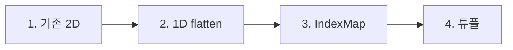

# Mini NPU Simulator

AI의 MAC(Multiply-Accumulate) 연산 원리를 이해하기 위한 Cross/X 패턴 판별 시뮬레이터.

## 실행 방법

```bash
cd result
python main.py
```

모드 선택:
- **1** — 사용자 입력 (3×3): 필터 A, B, 패턴을 콘솔에 입력
- **2** — `data.json` 분석: JSON 데이터 일괄 판정 + 성능 분석 + 결과 요약

`data.json`은 프로젝트 루트(`../data.json`)에 있음.

### 모드 1 예시 입력 (instruction 예시)

필터 A (십자가):
```
0 1 0
1 1 1
0 1 0
```

필터 B (X):
```
1 0 1
0 1 0
1 0 1
```

패턴 (X):
```
1 0 1
0 1 0
1 0 1
```

예상 결과: A 점수 1.0, B 점수 5.0, 판정 B

## 구현 요약

### 파일 구조

| 파일 | 역할 |
| --- | --- |
| `main.py` | 진입점, 모드 선택, I/O, data.json 분석 흐름 |
| `npu_core.py` | MAC 연산, 판정, 라벨 정규화, 성능 측정, 패턴 생성 |
| `logger.py` | 예외 로깅 (표준 라이브러리 `logging`) |
| `../data.json` | 필터(5/13/25) + 테스트 패턴 |

### 라벨 정규화

JSON에는 같은 의미를 다른 문자로 표기한다. 내부에서는 `Cross`, `X` 두 값만 사용.

| JSON 값 | 표준 라벨 |
| --- | --- |
| `expected: "+"` | `Cross` |
| `expected: "x"` | `X` |
| filter 키 `"cross"` | `Cross` |
| filter 키 `"x"` | `X` |

### MAC 연산

```python
for i in range(n):
    for j in range(n):
        total += pattern[i][j] * filter[i][j]
```

NumPy 없이 이중 반복문으로 구현. 연산 횟수 = N².

### 동점 처리 (epsilon)

`abs(score_cross - score_x) < 1e-9` 이면 **UNDECIDED** (판정 불가).
모드 2에서 UNDECIDED는 expected와 다르면 **FAIL**.

## 결과 리포트

### FAIL 케이스 분석

`data.json` 6개 패턴 실행 시 **3 PASS / 3 FAIL** (실제 측정 결과).

| 케이스 | Cross 점수 | X 점수 | expected | 판정 | 결과 |
| --- | --- | --- | --- | --- | --- |
| size_5_1 | 0.9 | 0.8999999999999999 | X | UNDECIDED | **FAIL** |
| size_5_2 | 8.9 | 0.1 | Cross | Cross | PASS |
| size_13_1 | 0.3 | 14.7 | X | X | PASS |
| size_13_2 | 7.5 | 7.5 | Cross | UNDECIDED | **FAIL** |
| size_25_1 | 4.9 | 4.899999999999999 | X | UNDECIDED | **FAIL** |
| size_25_2 | 52.9 | 0.1 | Cross | Cross | PASS |

**1단계 — 동점의  원인: **

- **size_5_1** (X 패턴 입력): X 필터 대각선 9칸 × 0.1 = **0.9**. Cross 필터 중심 [2][2] = **0.9**이고 입력 중심도 1.0 → Cross 점수 **0.9**. 이론상 0.9 vs 0.9 동점.
- **size_13_2** (Cross 패턴 입력): Cross 필터 십자가 25칸 × 0.3 = **7.5**. X 필터 중심 [6][6] = **7.5**로, Cross 패턴이 와도 중심 한 칸만 겹쳐 X 점수 **7.5**. 이론상 7.5 vs 7.5 동점.
- **size_25_1** (X 패턴 입력): X 필터 대각선 49칸 × 0.1 = **4.9**. Cross 필터 중심 [12][12] = **4.9** → Cross 점수 **4.9**. 이론상 4.9 vs 4.9 동점.

즉 expected는 X 또는 Cross인데, MAC 점수만으로는 어느 쪽도 고를 수 없는 **구조적 동점** 케이스다.

**2단계 — 부동소수점 오차와 epsilon의 역할**

이론상 같은 값이어도 Python float 누적 연산에서 `0.9` vs `0.8999999999999999`, `7.5` vs `7.499999999999997`처럼 미세한 차이가 출력된다.
`1e-9` epsilon 정책으로 차이가 무시 가능한 수준이면 **UNDECIDED**로 안정적으로 식별하고, UNDECIDED ≠ expected이므로 **FAIL** 처리한다.

**3개 PASS인 이유**

- MAC 점수 차이가 epsilon 밖 → Cross 또는 X 판정이 명확
- 라벨 정규화(`+`→Cross, `x`→X) 후 판정 == expected

### 시간 복잡도 O(N²) 분석

MAC 연산은 N×N 행렬 전체를 한 번 순회하므로 **연산 횟수 = N²** (곱셈 N²번 + 덧셈 N²-1번).

| 크기 | 연산 횟수 (N²) | 측정 의미 |
| --- | --- | --- |
| 3×3 | 9 | 기준점, 가장 빠름 |
| 5×5 | 25 | 약 2.8배 연산 |
| 13×13 | 169 | 약 18.8배 연산 |
| 25×25 | 625 | 약 69.4배 연산 |

실제 측정에서도 크기가 커질수록 평균 시간이 증가한다.
25×25는 3×3 대비 연산량이 69배인데, 시간도 비슷한 비율로 늘어나는 경향을 보인다.
이는 MAC이 **선형이 아니라 제곱**에 비례하는 대표적인 O(N²) 패턴이다.

AI/NPU에서 필터가 수백×수백이고 수천 개면 N² × 필터 수가 폭발적으로 커지기 때문에,
CPU 직렬 처리로는 감당 못 하고 NPU가 MAC을 병렬로 처리한다.

### 보너스 — 4방식 MAC 비교 (실측)



| 단계 | 하는 일 | 루프 |
| --- | --- | --- |
| 1. 기존 2D | `pattern[r][c] * filter[r][c]` | 전칸, 이중 for |
| 2. 1D flatten | 한 줄로 펴고 `pattern[i] * filter[i]` | 전칸, 단일 for |
| 3. IndexMap | 유효 인덱스만 뽑고 `pattern[idx] * filter[idx]` | 0 아닌 칸, 조회 2번 |
| 4. 튜플 | `(idx, weight)` — `pattern[idx] * weight` | 0 아닌 칸, 조회 1번 |

같은 입력, 전처리(flatten / 인덱스 생성 / 튜플 추출)는 측정에서 빼고, MAC 함수만 20000회 평균.

실행 환경: 로컬 `python3 main.py` 모드 2.

| 크기 | 1. 기존 2D (ms) | 2. 1D flatten (ms) | 3. enum IndexMap (ms) | 4. (idx, value) 튜플 (ms) |
| --- | --- | --- | --- | --- |
| 3×3 | 0.0011 | 0.0006 | 0.0004 | 0.0004 |
| 5×5 | 0.0023 | 0.0014 | 0.0006 | 0.0006 |
| 13×13 | 0.0109 | 0.0076 | 0.0013 | 0.0012 |
| 25×25 | 0.0381 | 0.0305 | 0.0021 | 0.0023 |

**1 → 2:** 2중 리스트 조회와 이중 `for`가 단일 루프·1단계 조회로 줄어 3×3에서 약 45% 단축. N이 커지면 루프 오버헤드 비중이 작아져 25×25는 약 20% 단축에 그침. 복잡도 자체는 그대로 O(N²).

**2 → 3:** `FilterType` + size 공식으로 유효 인덱스만 순회. 25×25는 625칸 → 49칸. 시간이 약 1/15. 대신 MAC 때 `pattern[idx] * filter[idx]`라 리스트 조회가 2번.

**3 → 4:** 조회 2번을 `(idx, weight)` 언패킹 1번으로 바꿈. 이번 실측에서는 13×13까지는 튜플이 같거나 조금 빠르고, 25×25는 IndexMap이 조금 더 빨랐다. 49번 루프에서는 튜플 언패킹 비용과 조회 1회 절감이 거의 상쇄된다. 그래도 4가 맞다: JSON 가중치(0.9, 7.5, 4.9)를 값으로 들고 있어서 원본 필터 배열을 MAC 루프에서 안 봐도 된다.

**실시간 `if == 0: continue`는 안 씀.** 파이썬에서 분기 비용이 곱셈보다 커서, 0을 건너뛰려면 필터 로드 때 미리 빼 두는 쪽이 이득이다.

